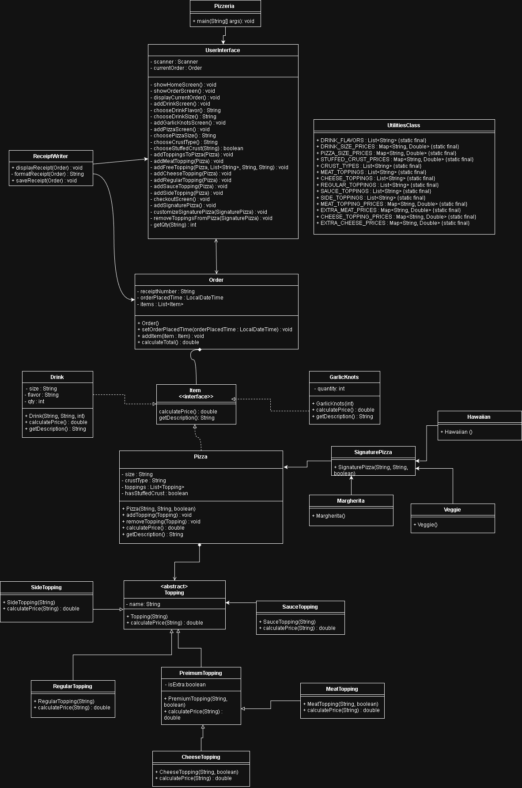
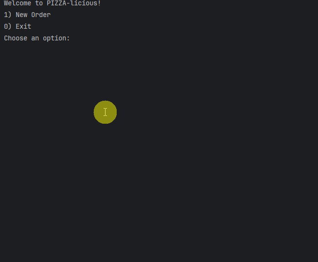
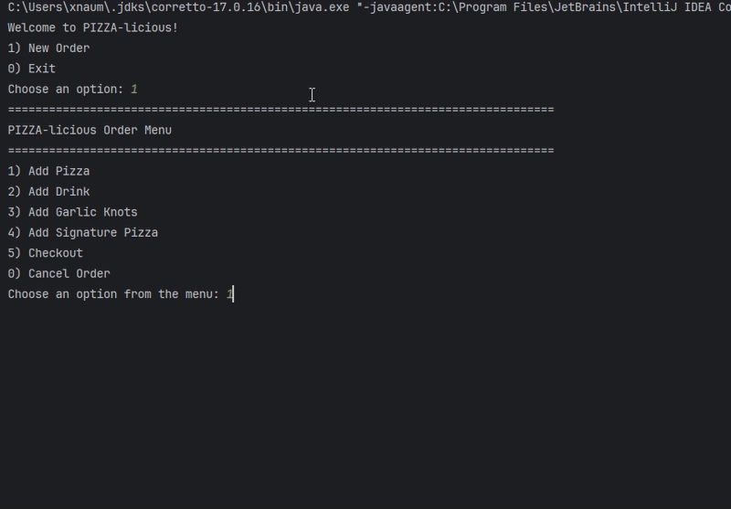
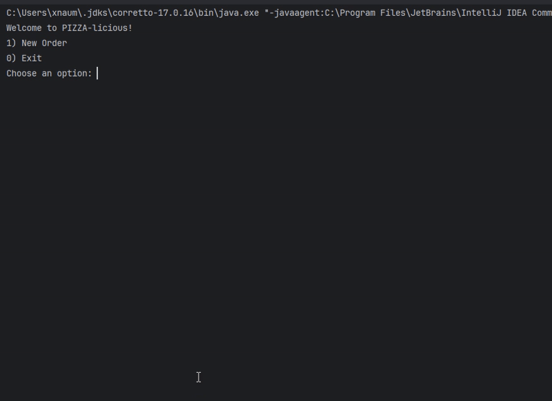
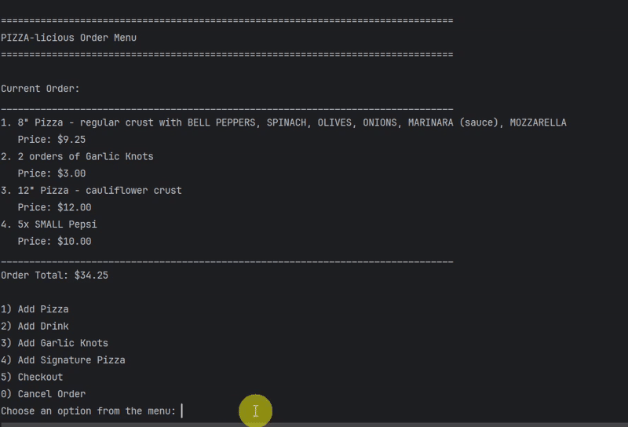

# PIZZA-licious🍕

## Description of the Project
PIZZA-licious is a console-based application for a pizza shop where a customer can build an order from the available options and customize to preference. 
The customer can add pizza, customizing size, crust, and toppings, or select signature pizzas, such as Margherita, Veggie, and Hawaiian.
Customers can also add drinks in various flavors and sizes, as well as garlic knots to complete their meal. 
The application displays the running total as items are added, shows all order details before checkout, 
and generates a receipt to be both displayed on screen and saved into a directory for the owner.

## User Stories
- As a customer I want to see a final receipt after paying for my order so that I can verify I was charged properly.
- As a customer I want to order pre-built pizzas with the option to customize them so that I can quickly order popular options without having to create my own custom pizza.
- As a customer I want to see a summary of my order so that I can check out and pay for my order.
- As a customer I want to customize my pizza by being able to add toppings so that I can better fit the pizza to my taste.
- As a customer I would like to see the items from my current order with the most recent add-ons first so that I can see what I have added to my order.
- As a customer I want to add my final Pizza with my customized options to the order so that I can check out or add other items
- As a customer I want to begin an order from the Home Screen so that I can choose which item I would like to buy.
- As a customer I want to be prompted with the order menu where I can choose what to add to my order so that I can build out my meal.
- As a customer I want to add drinks to my order with a preferred size and flavor so that I can have a beverage with my meal.
- As a customer I want to add garlic knots by quantity to my order so that I can add a side option for my meal.
- As a customer I want to pick the starting options for pizza so that I am able to customize it farther later.
- As an owner of the pizzeria I want to have a file that saves all orders, so I can review the transactions later.

## Setup

Instructions on how to set up and run the project using IntelliJ IDEA.

### Prerequisites

- **IntelliJ IDEA**: Ensure you have IntelliJ IDEA installed, which you can download from [here](https://www.jetbrains.com/idea/download/)
- **Java SDK**: Make sure Java SDK 17 or higher is installed and configured in IntelliJ.

### Running the Application in IntelliJ

Follow these steps to get your application running within IntelliJ IDEA:

1. Open IntelliJ IDEA.
2. Select "Open" and navigate to the directory where you cloned or downloaded the project.
3. After the project opens, wait for IntelliJ to index the files and set up the project.
4. Find the main class: `src/main/java/com/pluralsight/pizzeria/Main.java`
5. Right-click on the `Main.java` file and select 'Run Main.main()' to start the application.

## Technologies Used

- **Java 17**: openjdk 17.0.12 2024-07-16
## Demo

### Home Screen
*The home screen where users can start a new order or exit the application.*

### Order Menu
*Main order screen showing current order items and options to add pizzas, drinks, or garlic knots.*

### Pizza Customization
*Adding a new pizza to order with customization*

### Signature Pizza Selection
*Pre-made signature pizzas available for quick ordering.*

### Checkout Receipt
*Final receipt showing itemized order with total.*

## Future Work
- **Edit/Remove Items**: Allow customers to remove or modify items in their cart before checkout
- **Tax Rate**: Add taxes to customer total
- **Sales Stats**: Statistical overview of daily sales, orders completed, common items.

## Resources
- [Java Directories](https://www.baeldung.com/java-create-directory)
- [Java Tutorials](https://www.tutorialspoint.com/java/index.htm)

## Thanks
- Thank you to **Raymond Maroun** for continuous support and guidance throughout this project.
